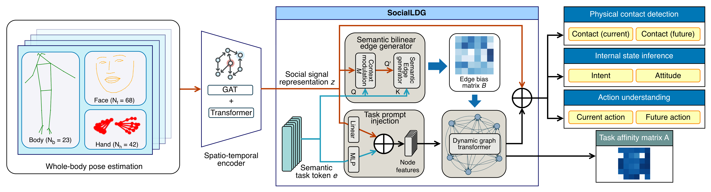

# SocialLDG

[//]: # (This is the official repo for the ACM MM 25 paper:)

[//]: # ()

[//]: # ([Robust Understanding of Human-Robot Social Interactions through Multimodal Distillation]&#40;https://arxiv.org/abs/2505.06278&#41; [![arXiv]&#40;https://img.shields.io/badge/arXiv-2505.06278-b31b1b.svg&#41;]&#40;https://arxiv.org/abs/2505.06278&#41;)

<div align="center">
    
</div>

Abstract:
For a robot to be called socially intelligent, it must be able to infer users internal states from their current
behaviour, predict the users future behaviour, and if requires, respond appropriately. In this work, we investigate how
robots can be endowed with such social intelligence by modelling the dynamic relationship between user's internal
states (latent) and actions (observable state). Our premise is that these states arise from the same underlying
socio-cognitive process and influence each other dynamically. Drawing inspiration from theories in Cognitive Science, we
propose a novel multi-task learning framework, termed as \textbf{SocialLDG} that explicitly models the dynamic
relationship among the states repsented as six distinct tasks. Our framework uses a language model to introduce lexical
priors for each task and employs dynamic graph learning to model task affinity evolving with time. SocialLDG has three
advantages: First, it achieves state-of-the-art performance on two challenging human-robot social interaction datasets
available publicly. Second, it supports strong task scalability by learning new tasks seamlessly without catastrophic
forgetting. Finally, benefiting from explicit modelling task affinity, it offers insights on how different interactions
unfolds in time and how the internal states and observable actions influence each other in human decision making.

<div align="center">
    
</div>

The framework takes egocentric video as input to extract whole-body pose sequences. A spatio-temporal encoder processes
these sequences to generate social signal representations $z$. Finally, our multi-task classifier, SocialLDG, models the
dynamic interactions among tasks and jointly predicts multiple social tasks while outputting the task affinity
matrix $\mathbf{A}$.

## Result

###Performance

|                      | Params (M)  | Latency (ms) | Con_cur F1   | Con_Fut F1   | Int F1       | Att F1       | Act_cur F1   | Act_fut F1   | Avg F1       |
|----------------------|-------------|--------------|--------------|--------------|--------------|--------------|--------------|--------------|--------------|
| Parallel             | 0.06        | 0.46         | 89.60        | 88.09        | 75.82        | 81.02        | 75.14        | 70.59        | 80.11        |
| MMoE [1]             | <u>0.27</u> | 1.09         | 90.74        | 87.62        | 77.87        | 83.05        | 80.55        | 73.49        | 82.22        |
| PLE [2]              | 0.47        | 2.08         | **92.44**    | 85.63        | 81.21        | 85.09        | 80.89        | 71.94        | 82.87        |
| DSelect-K [3]        | 0.47        | 1.30         | 91.30        | 87.90        | 80.03        | <u>85.88</u> | **82.43**    | 72.63        | 83.36        |
| UinT [4]             | 1.73        | <u>0.74</u>  | 90.55        | 88.65        | <u>81.70</u> | 85.02        | 78.54        | 73.21        | 82.98        |
| HiPro [5]            | 0.68        | 1.18         | 90.55        | 88.28        | 78.89        | 84.88        | 79.24        | 73.42        | 82.58        |
| AssociationGraph [6] | 0.45        | 0.91         | 90.93        | <u>89.04</u> | 81.32        | 86.64        | 81.20        | <u>74.31</u> | <u>83.74</u> |
| **SocialLDG**        | 1.40        | 1.30         | <u>92.25</u> | **91.68**    | **82.51**    | **85.99**    | <u>82.10</u> | **76.85**    | **85.25**    |

Table.1 Comparison with SOTA MTL methods in terms of F1 score (in \%)
on [JPL-Social [7]](https://github.com/biantongfei/SocialEgoNet)
and [HARPER [8]](https://github.com/intelligolabs/HARPER). The
best results are in bold, and the second-best results are underlined. The reported parameter counts (Params) and
inference latency solely account for the multi-task classifier.

SocialLDG achieves an average F1 score of 85.61\% and an average accuracy of 85.23\%, outperforming all the MTL
baselines. This demonstrates that SocialLDG aligns with the coupling and intrinsic correlations inherent in tasks. The
action of `punching' is inevitably accompanied by a `negative' attitude and `physical contact'. By using the dynamic
graph network and the edge generator, SocialLDG integrates dynamic contexts to bridge informational interaction across
tasks. In terms of computational efficiency, although SocialLDG ranks second to last in parameter size and latency among
the compared methods, it remains well within the acceptable limits for practical deployment.

## Data

The datasets used in this paper can be downloaded here:
JPL_Social [7] ([pose](https://drive.google.com/file/d/1_-munn3YrbmLYdqm3pEDV4oUmOwZeTVz/view?usp=drive_link), [videos](http://michaelryoo.com/jpl-interaction.html))
and
HARPER [8] ([pose](https://drive.google.com/file/d/1VMUnS4ieDmnLqRk1wRm_cvbRbMnf96c9/view?usp=drive_link), [images](https://github.com/intelligolabs/HARPER)).
A detailed description of the datasets can be found here: [JPL-Social](https://github.com/biantongfei/SocialEgoNet)
and [HARPER](https://github.com/intelligolabs/HARPER).

## Train and Test

[//]: # (## Installation and download data)

[//]: # ()
[//]: # (```)

[//]: # (pip install gdown)

[//]: # (gdown --id '1_-munn3YrbmLYdqm3pEDV4oUmOwZeTVz' -O JPL_Social.zip)

[//]: # (gdown --id '1_-1VMUnS4ieDmnLqRk1wRm_cvbRbMnf96c9' -O HARPER.zip)

[//]: # (mkdir -p ./SocialLDG_data)

[//]: # (unzip JPL_Social.zip -d ./SocialLDG_data)

[//]: # (unzip HARPER.zip -d ./SocialLDG_data)

[//]: # (rm JPL_Social.zip)

[//]: # (rm HARPER.zip)

[//]: # (git clone https://github.com/biantongfei/SocialLDG.git)

[//]: # (cd SocialLDG)

[//]: # (```)


### Conda

```
conda env create -f environment.yml
conda activate SocialLDG  
```

### Pip

```
pip install -r requirements.txt
```

To train a new spatio-temporal encoder, run

```
python scripts/train_autoencoder --cfg configs/AutoEncoder.yaml --data_path ../SocialLDG_data/
```

To train a new SocialLDG, run

```
python scripts/train_SocialLDG.py --cfg configs/SocialLDG.yaml --data_path ../SocialLDG_data/ --pretrained_encoder checkpoints/autoencoder_rl32_zmr50.pt
```

To test the pretrained weights of SocialLDG, run

```
python scripts/test_SocialLDG.py --cfg configs/SocialLDG.yaml --data_path ../SocialLDG_data/ --checkpoint_path checkpoints/encoder_SocialLDG_contact_current_contact_future_intention_attitude_action_current_action_future.pt 
```

[//]: # (## Citation)

[//]: # ()
[//]: # (Please cite the following paper if you use this repository in your research.)

[//]: # ()
[//]: # (```)

[//]: # (@inproceedings{bian2025robust,)

[//]: # (  title={Robust Understanding of Human-Robot Social Interactions through Multimodal Distillation},)

[//]: # (  author={Bian, Tongfei and Chollet, Mathieu and Guha, Tanaya},)

[//]: # (  booktitle={Proceedings of the 33rd ACM International Conference on Multimedia},)

[//]: # (  pages={5726--5734},)

[//]: # (  year={2025})

[//]: # (})

[//]: # (```)

## References

```
[1] Ma, Jiaqi, et al. "Modeling task relationships in multi-task learning with multi-gate mixture-of-experts." Proceedings of the 24th ACM SIGKDD international conference on knowledge discovery & data mining. 2018.
[2] Tang, Hongyan, et al. "Progressive layered extraction (ple): A novel multi-task learning (mtl) model for personalized recommendations." Proceedings of the 14th ACM conference on recommender systems. 2020.
[3] Hazimeh, Hussein, et al. "Dselect-k: Differentiable selection in the mixture of experts with applications to multi-task learning." Advances in Neural Information Processing Systems 34 (2021): 29335-29347.
[4] Hu, Ronghang, and Amanpreet Singh. "Unit: Multimodal multitask learning with a unified transformer." Proceedings of the IEEE/CVF international conference on computer vision. 2021.
[5] Liu, Yajing, et al. "Hierarchical prompt learning for multi-task learning." Proceedings of the IEEE/CVF conference on computer vision and pattern recognition. 2023.
[6] Shen, Jiayi, et al. "Association graph learning for multi-task classification with category shifts." Advances in Neural Information Processing Systems 35 (2022): 4503-4516.
[7] Bian, Tongfei, et al. "Interact with me: Joint egocentric forecasting of intent to interact, attitude and social actions." 2025 IEEE International Conference on Multimedia and Expo (ICME). IEEE, 2025.
[8] Avogaro, Andrea, et al. "Exploring 3D human pose estimation and forecasting from the robot’s perspective: The HARPER dataset." 2024 IEEE/RSJ International Conference on Intelligent Robots and Systems (IROS). IEEE, 2024.
```
